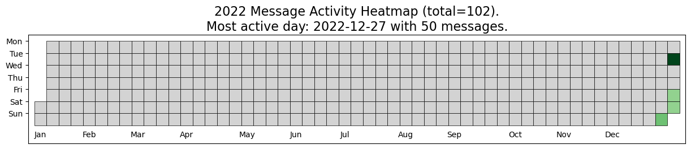
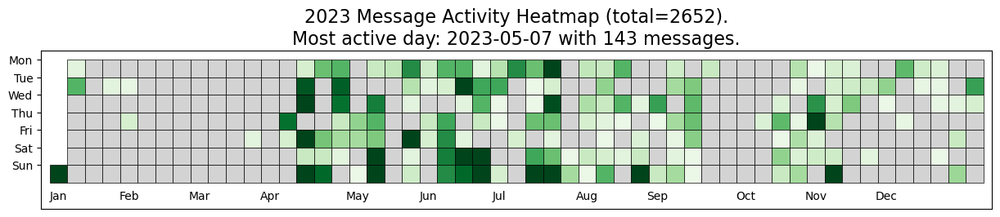
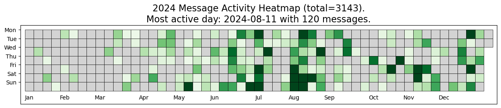
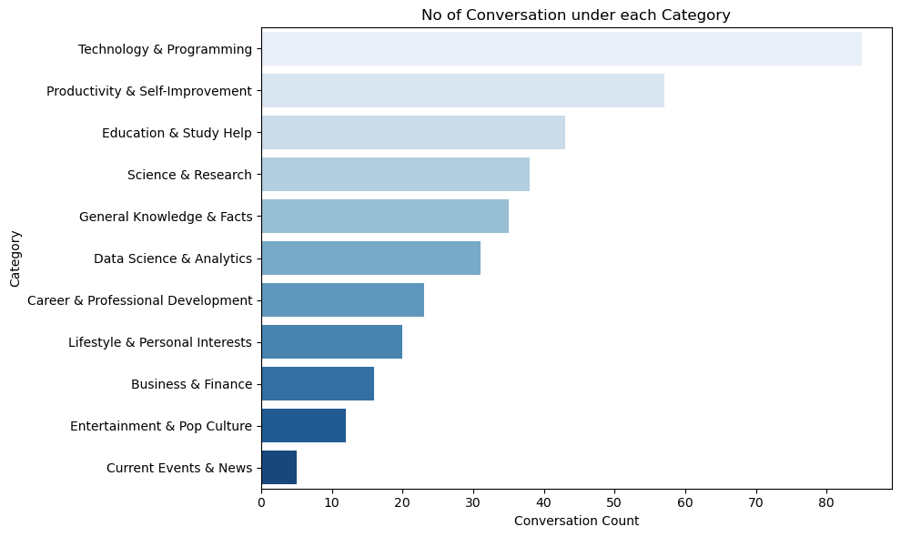

# ChatGPT Conversations Data Visualization

This project visualizes data from my ChatGPT conversations and categorizes the conversation titles into different topics using **Hugging Face's Zero-Shot Classification** model. Inspired by **Chip Huyen's** repository, which used ChatGPT conversations to create a heatmap visualizing new conversations started, I decided to track the **number of chats** I’ve had with ChatGPT to visualize my activeness. Additionally, I extracted the conversation titles and categorized them, giving insight into the diversity of topics discussed.

## Features:
- **Chat Activity Heatmap**: Visualizes the number of messages exchanged with ChatGPT over the days, categorized by year. This shows the activeness of interactions over time.
- **Conversation Categorization**: Extracts the titles of conversations and categorizes them into predefined topics such as **Technology & Programming**, **Productivity & Self-Improvement**, **Education & Study Help**, etc., using the Hugging Face Zero-Shot Classification model.
- **Visualization**: Generates a horizontal bar chart to show the count of conversations in each category.

## Technologies Used:
- **Python** 
- **Pandas**: For data manipulation and analysis.
- **Seaborn/Matplotlib**: For visualizing data and generating heatmaps and bar charts.
- **Hugging Face**: For the Zero-Shot Classification model used to categorize conversation titles.
- **Jupyter Notebooks** (optional): For interactive analysis and visualizations.

## Getting Started:
1. Export your ChatGPT conversation data as `conversations.json`.
2. Place the `conversations.json` file inside the `data/` folder in the repository.

   **File structure example:**
   ```
   ChatGPT-ConversationsData-Visualization/
   ├── data/
   │   ├── conversations.json  <- Your exported ChatGPT conversations file
   ├── notebooks/
   │   ├── 1 - Creating Heat maps.ipynb  <- Jupyter notebook for analysis
   ├── images/
   ├── README.md
   ├── requirements.txt
   ```

### 🔹 **Step 2: Install Dependencies**  
Run the following command to install the required dependencies:  
```bash
pip install -r requirements.txt
```

### 🔹 **Step 3: Run the Notebook**  
Open the Jupyter notebook inside the `notebooks/` folder and run the analysis:

```bash
jupyter notebook "notebooks/1 - Creating Heat maps.ipynb"
```

This will generate insights and visualizations based on your conversations.


## Example Output:
1. **Heatmap of ChatGPT Activity**: A heatmap of daily conversation activity, broken down by year.





2. **Categorization of Conversations**: A bar chart showing the number of conversations under each category.


## Future Improvements:
- Expand the conversation categories to cover more topics.
- Create more detailed visualizations, such as word clouds or topic clustering.
- Automate data extraction from ChatGPT logs for better integration.

## Contributions:
Feel free to fork the repository, submit pull requests, and contribute. I’d love to see how others are using and improving this project!

## License:
This project is licensed under the MIT License.

## Contact:
If you have any questions or would like to collaborate on similar projects, feel free to reach out!
